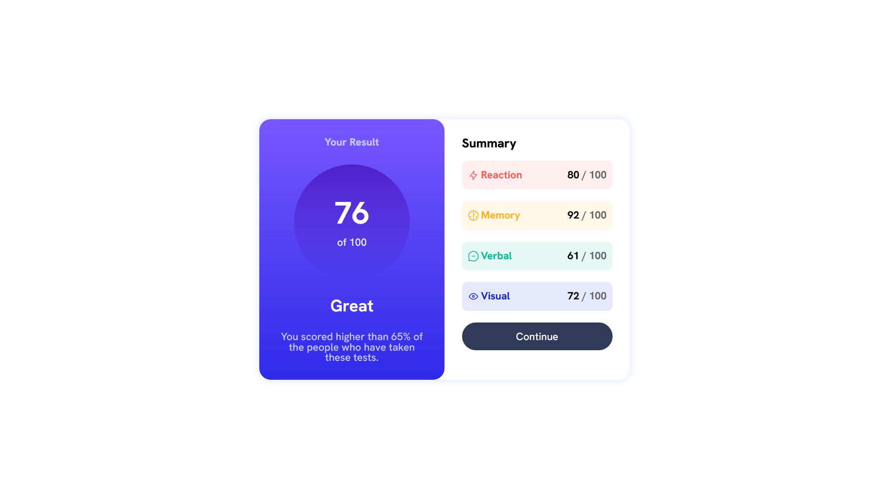

# Frontend Mentor - Results summary component solution

This is a solution to the [Results summary component challenge on Frontend Mentor](https://www.frontendmentor.io/challenges/results-summary-component-CE_K6s0maV). Frontend Mentor challenges help you improve your coding skills by building realistic projects. 

## Table of contents

- [Overview](#overview)
  - [The challenge](#the-challenge)
  - [Screenshot](#screenshot)
  - [Links](#links)
- [My process](#my-process)
  - [Built with](#built-with)
  - [What I learned](#what-i-learned)
  - [Continued development](#continued-development)
  - [Useful resources](#useful-resources)
- [Author](#author)

## Overview

### The challenge

Users should be able to:

- View the optimal layout for the interface depending on their device's screen size
- See hover and focus states for all interactive elements on the page
- **Bonus**: Use the local JSON data to dynamically populate the content

### Screenshot

### Links

- Solution URL: [Solution URL](https://github.com/AlbertoSocorro/results-summary-component-main)
- Live Site URL: [Live site URL](https://albertosocorro.github.io/results-summary-component-main/)

## My process

### Built with

- Semantic HTML5 markup
- CSS custom properties
- Flexbox
- CSS Grid
- Visual Studio

### What I learned

He mejorado mis habilidades con los flex y grid, ademas de con la programacion responsiva.

### Continued development

Tengo que seguir mejorando la estructura de la pagina, que en mi opinion esta un poco desordenada.

### Useful resources

Ninguna.

## Author

- Frontend Mentor - [@AlbertoSocorro](https://www.frontendmentor.io/profile/albertosocorro)
